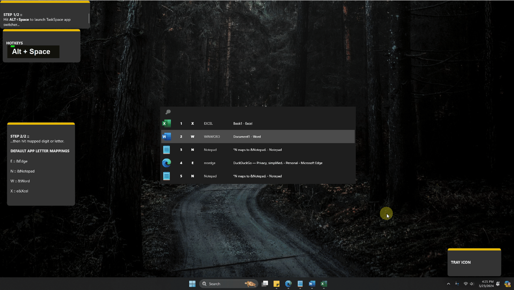
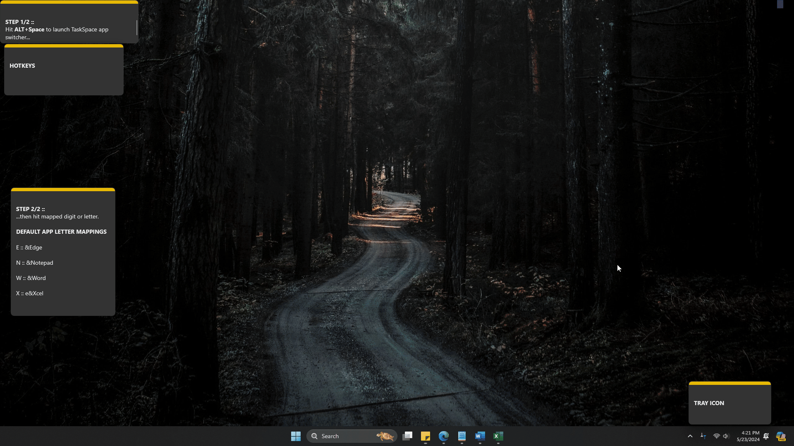

# TaskSpace

## Overview
TaskSpace is for anyone who spends more time using a keyboard than a mouse. Instead of alt-tabbing through a (long) list of open windows, TaskSpace allows you to quickly switch to any open window via a few key presses.

## ⌨️ Hotkeys / Shortcuts
### ⇄ Toggle Mode
- <b>`ALT`+`Space`</b>, <b>`Space`</b> => Pops-up TaskSpace, then after <b>`Space`</b> (without ALT held), toggles to next most recent window. Can be used for toggling between two most recent windows.

### 🧠 Mnemonic Mode
Switch to mapped apps with three key presses: start with <b>`ALT`+`Space`</b> then press a letter key mapped to a particular app.
- <b>`ALT`+`Space`</b> => Pops-up TaskSpace, awaiting the next user key press, e.g. `E`, `F`, `W`, `X`, etc.
- <b>`ALT`+`Space`, `E`</b> => <b>E</b>dge
- <b>`ALT`+`Space`, `F`</b> => <b>F</b>ile Explorer
- <b>`ALT`+`Space`, `W`</b> => <b>W</b>ord
- <b>`ALT`+`Space`, `X`</b> => e<b>X</b>cel

### 🔢 Numeric Mode
Switch to almost any open window with three key presses: start with <b>`ALT`+`Space`</b> then hit a digit key (numrow or numpad) or F key to switch from 1-st to 22-nd window.
- <b>`ALT`+`Space`</b> => Pops-up TaskSpace, awaiting the next user key press, e.g. `1`, `0`, `F12`, etc.
- <b>`ALT`+`Space`, `1`</b> => <b>1</b>-st (most recent) window
- <b>`ALT`+`Space`, `0`</b> => 1<b>0</b>-th most recent window
- <b>`ALT`+`Space`, `F12`</b> => 2<b>2</b>-nd most recent window

### 🔍 Search Mode
You can also activate the alternative search mode, then search through process and/or window names:
- <b>`ALT+Space`, `ALT+Space`</b> => Pops-up TaskSpace in search mode, awaiting the multikey search term.
- <b>`E`, `D`, `G`, `E`, `ENTER`</b> => Filters to `edge` windows (i.e. any "msedge" process) then switches to first one after `ENTER`.
- <b>`D`, `U`, `C`, `K`, `ENTER`</b> => Filters to `duck` windows (i.e. any browser window with focused DuckDuckGo tab) then switches to first one after `ENTER`. ⚠️ This example assumes the DuckDuckGo tab is focused in the browser (TaskSpace currently doesn't support searching across unfocused browser tabs).

## 📸 Screenshots

## 🎞️ GIFs
- Fast demo:

- Slow demo:

## 🖥️ Tray Icon
Change the launch hotkeys and more via the tray app icon .

## 📁 Projects in the Solution
1. **TaskSpace** - The main application that provides the user interface and integration logic for task switching.
2. **ManagedWinapi** - A library project that wraps Windows API calls needed for managing windows and tasks.
3. **Core** - Contains core functionalities and business logic used across the application.
4. **Core.UnitTests** - Contains unit tests for the Core project to ensure functionality works as expected.
5. **.build** - A project dedicated to build scripts and tasks, including MSBuild community tasks.

## 📋 Prerequisites
- Microsoft Visual Studio 2022 or later.
- .NET 8.0 for Core, Core.UnitTests, and TaskSpace projects.
- .NET Framework 4.8 for ManagedWinapi project.

## 🏗️ Building the Solution
1. Open `TaskSpace.sln` with Visual Studio.
2. Ensure all project dependencies are restored (e.g. NuGet packages).
3. Build the solution by selecting `Build > Build Solution` from the menu.

## ▶️ Running the Application
- After building, run the TaskSpace project by setting it as the startup project and pressing `F5` or selecting `Debug > Start Debugging`.

## ⚙️ Configuration
- The solution configurations for Debug and Release modes are defined under the GlobalSection of the solution file. Each project has specific configurations for building in these modes.

## 🤝 Contributing
- Contributions are welcome. Please fork the repository, make your changes, and submit a pull request.

## 📣 Credits
- [Switcheroo](https://github.com/kvakulo/Switcheroo) :: For the source code initially developed by [James Sulak](https://github.com/jsulak) and maintained by [Regin Larsen](https://github.com/kvakulo).
- [TaskSwitcher](https://github.com/taskscape/TaskSwitcher) :: For the source code forked from Switcheroo and maintained by [Taskscape](https://github.com/taskscape).
- [Managed Windows API](http://mwinapi.sourceforge.net) :: For the Windows API wrapper source code.
- [KeyPress OSD](https://keypressosd.com) :: For key press visualization in demo GIFs.
- [ShareX](https://getsharex.com) :: For capturing demo GIFs.

## ©️ License
- TaskSpace is open source and is licensed under the [GNU GPL v. 3](http://www.gnu.org/licenses/gpl.html).

## ✉️ Contact
- For more information or to report issues, please contact the repository maintainer or submit an issue in the project's issue tracker.
